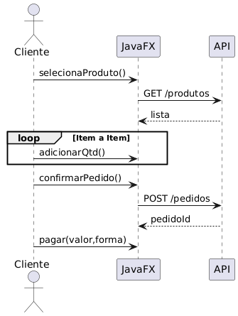
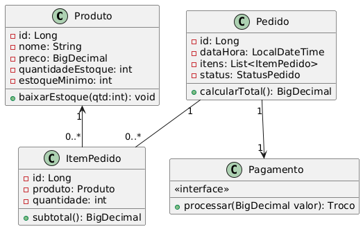
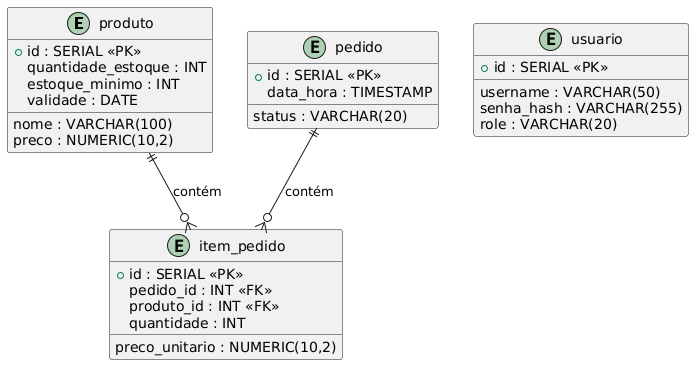
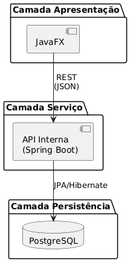

# Sistema de Autoatendimento para Cantina Universitária – Documentação

**Curso:** Ciência da Computação (URI – Santo Ângelo)  
**Disciplina:** Linguagem de Programação III  
**Professor:** Prof. Denilson Rodrigues da Silva

**Autores:** `Thiago Ruiz e Guilherme Marschall`  
**Versão:** 1.0 – 14/06/2025  
**Repositório:** `https://github.com/guilhermemarch/cantinasa`

---

## 1. Visão Geral

Este documento descreve a análise, projeto e instruções de implementação de um *terminal digital de autoatendimento* para cantinas universitárias. O sistema foi desenvolvido em **Spring Boot** (camada de negócio e persistência) e **JavaFX** (interface gráfica), seguindo arquitetura MVC e princípios SOLID.

---

## 2. Escopo do Protótipo

### 2.1 Funcionalidades Principais
- **Autoatendimento**: seleção de produtos, montagem do pedido, confirmação e pagamento.
- **Pagamentos**: simulação de valores em moeda/cédula com cálculo de troco.
- **Administração**: autenticação de funcionários, abastecimento de estoque, retirada de valores.
- **Relatórios**: produtos mais vendidos, horários de pico, transações, itens vencidos/próximos do vencimento.
- **Tratamento de Exceções**: falta de produto, ausência de troco, cancelamento de compra.


## 3. Arquitetura de Software



### 3.1 Padrões Utilizados
- **MVC** na UI JavaFX (`Controller`, `Service`, `Repository`).
- **DTO + Mapper** para comunicação REST interna.
- **Factory Method** para instanciar meios de pagamento.
- **Observer** para alertas de estoque.

---

## 4. Modelagem de Domínio

### 4.1 Diagrama de Classes (resumido)



### 4.2 Esquema de Banco (PostgreSQL)



---

## 5. Casos de Uso

### UC‑01 – Realizar Pedido
| Atores | Fluxo Principal |
|--------|-----------------|
| **Cliente** | 1. Seleciona categoria e produto.<br>2. Ajusta quantidades.<br>3. Confirma pedido.<br>4. Realiza pagamento.<br>5. Recebe comprovante. |




---

## 6. Componentes Principais

| Componente | Descrição |
|------------|-----------|
| **ProductService** | Regras de negócio do produto e estoque. |
| **OrderService** | Orquestra criação do pedido. |
| **PaymentStrategy** | Implementa `Pagamento` para dinheiro, cartão, PIX. |
| **ReportService** | Gera relatórios via JasperReports. |
| **AuthController** | Endpoints de login/logout admin (JWT). |

---


2. **Clone e Build**
   ```bash
   git clone https://github.com/<user>/cantina-kiosk.git
   cd cantina-kiosk
   mvn clean package -DskipTests
   ```

3. **Execução**
   ```bash
   java -jar backend/target/kiosk-api.jar
   java -jar desktop/target/kiosk-ui.jar
   ```

4. **Gerar Javadoc**
   ```bash
   mvn javadoc:javadoc
   open backend/target/site/apidocs/index.html
   ```
/src
 ├── model/           → Classes de domínio (Produto, Pedido, Estoque, etc.)
 ├── service/         → Regras de negócio (TotemService, PagamentoService, etc.)
 ├── admin/           → Área administrativa (gestão de estoque, relatórios)
 ├── ui/              → Interface gráfica (JFrames, painéis, botões, etc.)
 └── util/            → Utilitários (formatação, datas, geração de relatórios)
---

